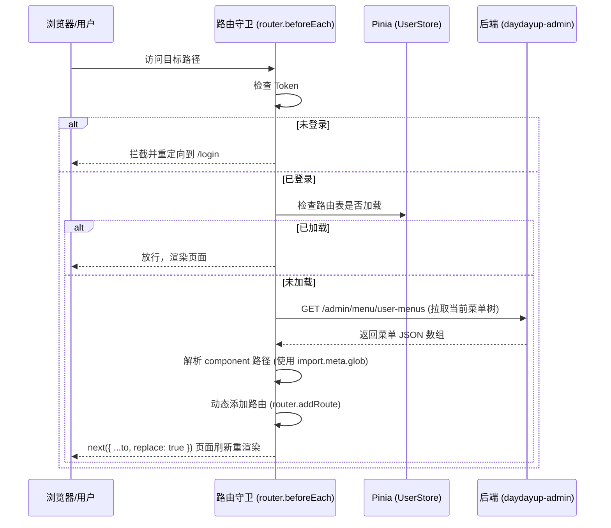

# DayDayUP 前端工程架构设计文档 (Monorepo)

- **创建日期**: 2026-06-18
- **版本**: v1.1
- **状态**: 已更新 (移除租户概念)

---

## 1. 概述
本文档为 `DayDayUP` 企业级微服务脚手架配套的前端工程设计方案。为满足未来多客户端（如游戏前台、社交应用等）与后台管理系统并存且共享底层网络、认证和工具库的需求，项目采用 **Monorepo (多包工作区)** 架构，基于 **pnpm workspace** 搭建。

首期重点实现基于 `Vite + Vue 3 + TypeScript + Pinia + Element Plus` 的**后台管理系统 (admin-ui)**，承载用户、角色、菜单管理及系统监控运维等功能。

---

## 2. 目录结构与 Workspace 配置
工程基于 `pnpm workspace` 划分，公共依赖在根目录下统一管理，各子包通过软链接方式实现本地开发即时热更新。

### 2.1 目录树
```text
daydayup-ui/
├── pnpm-workspace.yaml             # 工作区配置文件
├── package.json                    # 根依赖与启动脚本
├── tsconfig.json                   # 根 TypeScript 配置
├── .gitignore
├── packages/
│   ├── shared/                     # 公共通用库 (无 UI 绑定)
│   │   ├── package.json
│   │   ├── tsconfig.json
│   │   └── src/
│   │       ├── api/                # Axios 请求封装、拦截器
│   │       ├── store/              # 跨应用共用数据 (如 Token 存取)
│   │       ├── utils/              # 签名算法、加解密、常用工具
│   │       └── index.ts            # 统一导出入口
│   ├── components/                 # 共享 UI 组件包 (预留)
│   │   ├── package.json
│   │   └── src/
│   └── apps/                       # 具体应用目录
│       └── admin-ui/               # 后台管理系统 (Vue 3 + Vite + Element Plus)
│           ├── package.json
│           ├── vite.config.ts
│           ├── index.html
│           └── src/
│               ├── assets/         # 静态资源 (图片、字体)
│               ├── components/     # 业务组件
│               ├── layout/         # 框架容器布局 (Sidebar, Navbar, TagsView)
│               ├── router/         # 路由配置 (静态路由、权限拦截)
│               ├── store/          # 应用内 Pinia 状态
│               ├── views/          # 业务视图页面
│               └── main.ts         # 入口文件
```

### 2.2 基础配置文件
`pnpm-workspace.yaml` 内容：
```yaml
packages:
  - 'packages/*'
  - 'packages/apps/*'
```

---

## 3. 共享基础库设计 (`packages/shared`)
作为公共基础设施，`shared` 提供多应用通用的网络协议、安全性以及底层状态服务。

### 3.1 统一 API 网络请求 (基于 Axios)
- **请求拦截器 (Request Interceptor)**:
  - 自动从本地缓存加载由 `Authentication Server` 签发的 `access_token`，并在请求头中注入 `Authorization: Bearer <token>`。
- **开放接口加签 (Signature)**:
  - 针对带有特定加签标识的接口，由底层自动抓取 `timestamp` 与唯一随机值 `nonce`，利用 HmacSHA256 算法计算签名并加入请求头，防止防刷和重放攻击。
- **响应拦截器 (Response Interceptor)**:
  - 针对 `401 Unauthorized`：清理本地 Token 缓存，并广播通知或者重定向到登录页。
  - 针对 `403 Forbidden`：统一使用全局消息提示“暂无访问权限”。
  - 针对 `500 Server Error`：解析后端返回的 `R<T>` 统一结构，提示异常信息。

### 3.2 共享数据与状态管理
- 统一管理底层 Token 的 `getItem` 与 `setItem` 操作，对敏感的本地存储数据进行简易混淆，保证数据安全。

---

## 4. 后台管理应用设计 (`packages/apps/admin-ui`)
作为首个落地应用，提供高效、动态的后台运营支撑。

### 4.1 动态路由与菜单加载机制
为了满足后端菜单的实时生效与权限隔离，前端采用**动态路由守卫拦截**技术。



- **静态路由**:
  路由配置文件中仅注册 `/login`、`/404`、`/403` 以及作为系统承载基座的 `/` (`Layout` 组件)。
- **动态组件匹配**:
  利用 Vite 提供的 `import.meta.glob('/src/views/**/*.vue')` 扫描整个项目的 views 页面，将后端返回的 `views/system/user/index` 字符串解析为真正的异步 Vue 组件。

### 4.2 按钮级细粒度鉴权
- **自定义指令 `v-permission`**:
  在 Element Plus 的组件上使用 `v-permission="['admin:user:add']"`。指令生命周期中若检测到用户 `permissions` 列表中不包含此字符串，则调用 `el.parentNode?.removeChild(el)` 强行从 DOM 树中移除。

---

## 5. 开发环境与生产部署
### 5.1 本地代理跨域 (Vite Proxy)
在 `vite.config.ts` 配置中将 `/api` 转给本地的网关服务：
```typescript
server: {
  proxy: {
    '/api': {
      target: 'http://localhost:8080', // 指向 daydayup-gateway 端口
      changeOrigin: true,
      rewrite: (path) => path.replace(/^\/api/, '')
    }
  }
}
```

### 5.2 生产 Dockerfile (多阶段构建)
```dockerfile
# Stage 1: Build
FROM node:20-alpine AS builder
RUN npm install -g pnpm
WORKDIR /app
COPY . .
RUN pnpm install --frozen-lockfile
RUN pnpm --filter @daydayup/admin-ui build

# Stage 2: Serve
FROM nginx:alpine
COPY --from=builder /app/packages/apps/admin-ui/dist /usr/share/nginx/html
COPY ./deploy/nginx.conf /etc/nginx/conf.d/default.conf
EXPOSE 80
CMD ["nginx", "-g", "daemon off;"]
```

`nginx.conf` 核心重定向规则：
```nginx
location / {
    root   /usr/share/nginx/html;
    index  index.html index.htm;
    try_files $uri $uri/ /index.html; # 支持 Vue Router 的 HTML5 History 模式
}
```
