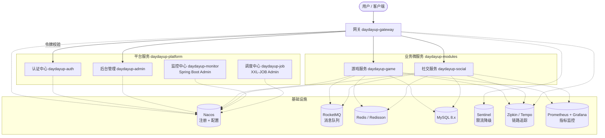
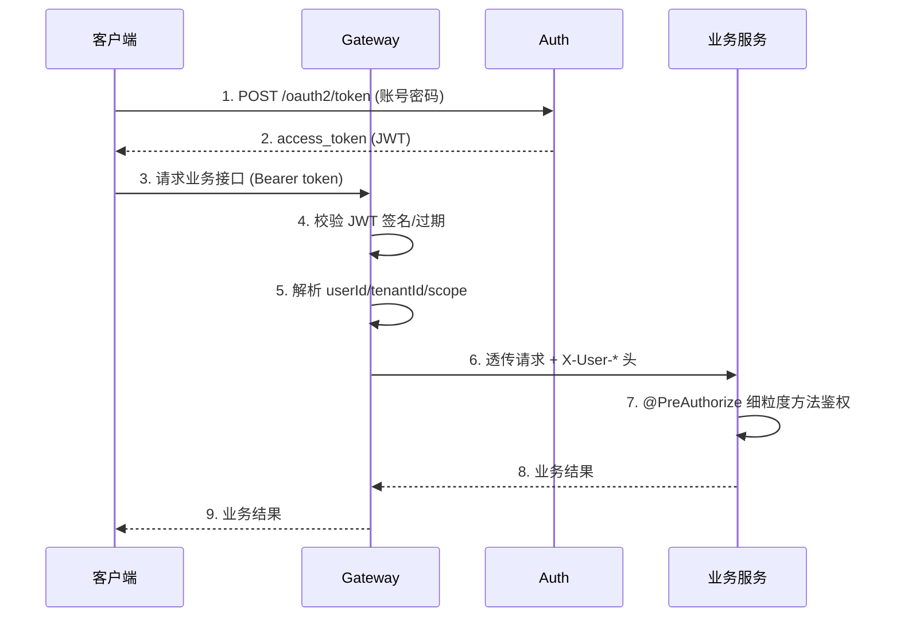

# 微服务架构 v1.1

> 本版本基于 v1.0 评审意见迭代而来。主要变化：
>
> 1. 业务模块去掉模糊的 `biz`，保留 `game` 与 `social` 两个清晰领域，预留按 DDD 限界上下文持续拆分的扩展点
> 2. 基础设施层补齐 **监控中心、调度中心、链路追踪、限流降级、日志聚合** 五项
> 3. 公共组件补齐 **feign / log / idempotent / lock** 四个高频能力
> 4. 明确 **网关 + 认证中心** 的协作模式
> 5. 留出 **数据层、部署、CI/CD、安全、配置管理** 的扩展点
> 6. 保持 Spring Boot 3.5.0 + Spring Cloud 2025.0.0 + Spring Cloud Alibaba 2025.0.0.0 全家桶，并给出版本兜底方案

---

## 1. 项目简介

DayDayUP 是一个基于 **JDK 21 + Spring Boot 3.5.0 + Spring Cloud 2025.0.0 + Spring Cloud Alibaba 2025.0.0.0** 构建的企业级微服务架构骨架。

定位：

* 作为一套**可演进**的微服务基础脚手架，覆盖网关、认证、业务、监控、调度、消息、缓存等常见能力
* 强制 **API + Biz 分离**，便于跨服务 Feign 调用与契约管理
* 公共组件高度内聚，业务模块按 **DDD 限界上下文** 持续拆分

---

## 2. 系统架构



---

## 3. 技术栈

| 类别 | 组件 | 版本 | 说明 |
| :--- | :--- | :--- | :--- |
| 语言 | JDK | 21 | LTS |
| 框架 | Spring Boot | 3.5.0 | 基础框架 |
| 微服务规范 | Spring Cloud | 2025.0.0 | Northfields |
| 微服务实现 | Spring Cloud Alibaba | 2025.0.0.0 | ⚠️ 见 §3.1 版本兜底 |
| 认证 | Spring Authorization Server | 1.4.3 | OAuth2.1 + OIDC |
| ORM | MyBatis-Plus | 3.5.10.1 | mybatis-plus-spring-boot3-starter |
| 缓存 | Redisson | 3.40.2 | 分布式锁 + 缓存客户端 |
| 消息 | RocketMQ Spring | 2.3.1 | 配合 RocketMQ 5.x Broker |
| 调度 | XXL-JOB | 2.4.2 | 分布式任务调度 |
| 数据库 | MySQL | 8.3.0 | |
| 监控 | Spring Boot Admin | 3.3.2 | 健康 / JVM / 端点可视化 |
| 指标 | Micrometer + Prometheus | 1.13.x | metrics 采集 |
| 链路 | Micrometer Tracing + Zipkin | brave 桥接 | 替代已废弃的 Sleuth |
| 限流 | Sentinel | spring-cloud-starter-alibaba-sentinel | 网关 + 服务双层限流 |
| 文档 | SpringDoc OpenAPI | 2.6.0 | 替代 SpringFox |
| AI（预留） | Spring AI / Spring AI Alibaba | 1.0.3 / 1.1.0.0-RC2 | 可选启用 |

### 3.1 版本兜底方案

Spring Cloud Alibaba `2025.0.0.0` 在编写本文档时尚未在 Maven 中央仓库正式 GA（最新公开 GA 为 `2023.x.y` 系列）。**实现阶段第一件事**是验证依赖可达性：

```bash
mvn -N dependency:get -Dartifact=com.alibaba.cloud:spring-cloud-alibaba-dependencies:2025.0.0.0:pom
```

* 若 **成功** → 保持当前版本组合
* 若 **失败** → 启动兜底方案：
  * Spring Boot 降为 `3.3.5`
  * Spring Cloud 降为 `2023.0.3`
  * Spring Cloud Alibaba 降为 `2023.0.3.3`（已 GA）

兜底版本统一放在父 `pom.xml` 的 `properties` 中，**仅切换版本号即可**，无需改造代码。

---

## 4. 模块说明

### 4.1 平台服务 `daydayup-platform`

提供系统级管理能力，自身不直接承载业务领域逻辑。

| 模块 | 说明 |
| :--- | :--- |
| **daydayup-auth** | 认证中心。基于 Spring Authorization Server，签发 / 校验 JWT，支持多客户端、多授权模式 |
| **daydayup-admin** | 后台管理。`api` + `biz` 分离，承载租户 / 用户 / 角色 / 菜单 / 字典等 |
| **daydayup-monitor** | 监控中心。基于 Spring Boot Admin，可视化展示注册到 Nacos 的所有服务健康度 |
| **daydayup-job** | 调度中心。XXL-JOB Admin 独立部署，业务服务通过 `xxl-job-core` 作为执行器接入 |

### 4.2 接入层 `daydayup-access`

| 模块 | 说明 |
| :--- | :--- |
| **daydayup-gateway** | 统一网关。Spring Cloud Gateway + Sentinel，承担路由、鉴权前置、限流、灰度染色 |

### 4.3 业务微服务 `daydayup-modules`

按领域纵向切分，强制 `api` + `biz` 分离架构。当前 v1.1 包含两个领域；后续按 DDD 限界上下文持续裂变（例如 `daydayup-user`、`daydayup-order` 等）。

| 模块 | 说明 |
| :--- | :--- |
| **daydayup-game** | 游戏领域。子领域示例：房间、匹配、对局、战绩 |
| **daydayup-social** | 社交领域。子领域示例：好友、动态、私信、群组 |

> ❌ **不再保留 v1.0 中的 `daydayup-biz`**——名字过于模糊，无法表达限界上下文，容易演变成"巨石服务"。

### 4.4 公共组件 `daydayup-common`

| 模块 | 用途 |
| :--- | :--- |
| **daydayup-common-core** | 基础常量、枚举、工具类、异常体系、统一返回 `R<T>` |
| **daydayup-common-web** | Web 通用配置：全局异常处理、Jackson、跨域、参数校验 |
| **daydayup-common-mybatis** | MyBatis-Plus 自动填充、分页、逻辑删除、多租户拦截器 |
| **daydayup-common-security** | 资源服务器适配，JWT 解析与 `SecurityContext` 构建 |
| **daydayup-common-redis** | Redis / Redisson 自动装配、序列化方案 |
| **daydayup-common-mq** | RocketMQ 生产者 / 消费者抽象、事务消息模板 |
| **daydayup-common-swagger** | SpringDoc 配置、Knife4j 聚合（可选） |
| **daydayup-common-feign** 🆕 | Feign 拦截器：透传 traceId / token / tenant，统一超时与重试 |
| **daydayup-common-log** 🆕 | `@OperLog` 注解，操作日志采集（异步入库或推送 RocketMQ） |
| **daydayup-common-idempotent** 🆕 | `@Idempotent` 注解，基于 Redis Token 的接口幂等 |
| **daydayup-common-lock** 🆕 | `@DistributedLock` 注解，封装 Redisson 分布式锁 |

> 🆕 标记为 v1.1 新增的公共组件。

---

## 5. 网关 + 认证协作模式

采用 **"网关粗粒度 + 服务细粒度"** 的混合模式：



约定：

* **网关**：负责 JWT 解码 + 黑名单 + 限流 + 灰度，**不查数据库**
* **业务服务**：通过 `daydayup-common-security` 从请求头还原用户上下文，**只做方法级 @PreAuthorize**
* **认证中心**：只负责签发与吊销，不承担鉴权逻辑

---

## 6. 目录结构

```text
daydayup
├── daydayup-access                # 接入层
│   └── daydayup-gateway           # 网关服务
├── daydayup-common                # 公共组件
│   ├── daydayup-common-core
│   ├── daydayup-common-web
│   ├── daydayup-common-mybatis
│   ├── daydayup-common-security
│   ├── daydayup-common-redis
│   ├── daydayup-common-mq
│   ├── daydayup-common-swagger
│   ├── daydayup-common-feign      # 🆕
│   ├── daydayup-common-log        # 🆕
│   ├── daydayup-common-idempotent # 🆕
│   └── daydayup-common-lock       # 🆕
├── daydayup-modules               # 业务模块
│   ├── daydayup-game              # 游戏 (api/biz)
│   │   ├── daydayup-game-api
│   │   └── daydayup-game-biz
│   └── daydayup-social            # 社交 (api/biz)
│       ├── daydayup-social-api
│       └── daydayup-social-biz
├── daydayup-platform              # 平台服务
│   ├── daydayup-auth              # 认证中心
│   ├── daydayup-admin             # 后台管理 (api/biz)
│   │   ├── daydayup-admin-api
│   │   └── daydayup-admin-biz
│   ├── daydayup-monitor           # 监控中心
│   └── daydayup-job               # 调度中心
├── sql                            # 初始化脚本
├── pom.xml                        # 父工程依赖管理
├── 微服务架构v1.md                 # v1.0（已归档）
└── 微服务架构v1.1.md               # 当前版本
```

---

## 7. 横切关注点与扩展点

### 7.1 数据层（v1 暂不引入，留扩展点）

* **读写分离**：通过 `dynamic-datasource` 注解 `@DS` 切换主从
* **分库分表**：必要时引入 ShardingSphere-JDBC
* **搜索引擎**：商品 / 内容 / 日志检索预留 Elasticsearch 8.x

### 7.2 消息驱动

* **事务消息**：业务跨服务一致性优先使用 RocketMQ 事务消息
* **延迟消息**：订单超时、定时任务用 RocketMQ 延时等级
* **领域事件**：业务服务通过 `daydayup-common-mq` 发布 `DomainEvent`，订阅方按需消费

### 7.3 可观测性

| 维度 | 方案 |
| :--- | :--- |
| 指标 | Micrometer → Prometheus → Grafana |
| 链路 | Micrometer Tracing + Zipkin（Brave 桥接） |
| 日志 | Logback JSON → Filebeat → ELK / Loki |
| 健康 | Spring Boot Admin（`daydayup-monitor`） |
| 告警 | Prometheus AlertManager + 钉钉 / 飞书 webhook |

### 7.4 配置管理

* **多环境**：Nacos `namespace` 区分 dev / test / prod
* **公共配置**：`daydayup-common.yaml` 作为 shared-dataIds，被所有服务引用
* **敏感配置**：Nacos 加密 + 启动参数注入双重保险

### 7.5 安全

* **接口加签**：对外开放接口必须签名（HmacSHA256 + 时间戳 + nonce）
* **数据脱敏**：通过 Jackson Serializer 注解 `@Sensitive(type = MOBILE)` 自动脱敏
* **XSS / SQL 注入**：`daydayup-common-web` 全局过滤 + MyBatis-Plus 参数化查询

### 7.6 部署与 CI/CD（v1 留接口，v2 落地）

* 每个服务模块附带 `Dockerfile`
* 根目录预留 `docker-compose.yml` 一键起 Nacos / Redis / MySQL / RocketMQ 本地开发环境
* CI 使用 GitHub Actions（mvn verify → docker build → push → 触发部署）

---

## 8. 开发规范

### 8.1 分层与命名

* 业务服务必须 `*-api` + `*-biz` 分离
  * `*-api`：DTO / VO / Query / Feign Client 接口，**只能被其他服务依赖**，**不依赖任何 starter**
  * `*-biz`：Entity / Mapper / Service / Controller，**可独立部署**
* Java 包统一前缀：`com.yuan.daydayup.<module>`
* Controller 必须以 `Controller` 结尾，Service 接口与实现按 `XxxService` / `XxxServiceImpl` 分离

### 8.2 异常与返回

* 全局统一返回 `R<T>`（来自 `daydayup-common-core`）
* 业务异常抛 `BizException(ErrorCode)`，由 `daydayup-common-web` 全局兜底
* 严禁 Controller 层 `try/catch` 吞异常

### 8.3 注释与文档

* 公共类、对外 API 必须有 Javadoc（中文）
* 接口必须使用 SpringDoc 注解（`@Operation` / `@Schema`）
* 复杂业务流程在 Service 方法上用 `@apiNote` 补充意图，不解释 WHAT 只解释 WHY

### 8.4 数据库

* 表前缀按领域：`game_`、`social_`、`sys_`、`auth_`
* 所有表必须有 `id / create_time / update_time / create_by / update_by / deleted` 六个标准字段（由 MP 自动填充）
* 字段命名 `snake_case`，Java 字段 `camelCase`

### 8.5 公共能力使用

* 操作日志：`@OperLog(title = "新增用户", businessType = BusinessType.INSERT)`
* 幂等：`@Idempotent(key = "#dto.orderNo", expire = 5)`
* 分布式锁：`@DistributedLock(key = "'order:' + #orderId", waitTime = 3, leaseTime = 10)`
* 不允许在业务代码里直接 `new Redisson()`、直接写 Feign Client 重复造轮子

---

## 9. 落地路线图

| 阶段 | 目标 | 产出 |
| :--- | :--- | :--- |
| **P0 骨架** | 父 pom + common 全部模块 + 空的业务模块骨架 | 项目能 `mvn clean install` |
| **P1 平台** | gateway + auth + admin 三服务可启动并通信 | 登录拿 token + 调一个受保护接口 |
| **P2 业务** | game / social 两服务最小可运行 demo | Feign 互调跑通 |
| **P3 中间件** | Redis / RocketMQ / Sentinel / 监控接入 | 监控大盘可见 |
| **P4 增强** | 调度中心 / 链路追踪 / 操作日志 / 幂等 / 锁 | 公共组件全部能力可用 |
| **P5 部署** | Dockerfile + docker-compose + CI 流水线 | 一键拉起完整本地环境 |
